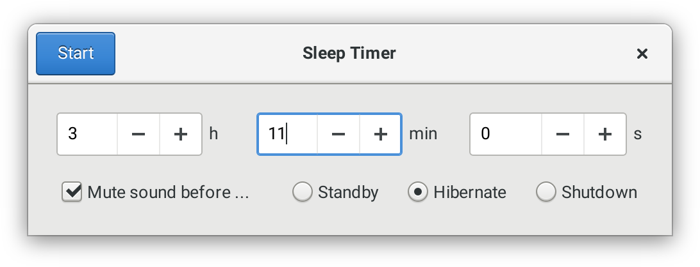

# Sleep Timer



## Windows

### Native Python

Install [Visual Studio 2015](https://www.visualstudio.com/de-de/downloads/download-visual-studio-vs.aspx)
with C++ support, [Python 3](https://www.python.org/downloads/) and [PyGObject for Windows](http://sourceforge.net/projects/pygobjectwin32/) with "Base packages" and "Gtk+".

### MSYS2

Open the Mingw64 shell and type:

```
pacman -S mingw-w64-x86_64-python3-gobject mingw-w64-x86_64-gtk3
python3 main.py
```

To create a distributable exe file:

```
pacman -S mingw-w64-x86_64-python3-cx_Freeze
python3 setup.py cx_Freeze
```
